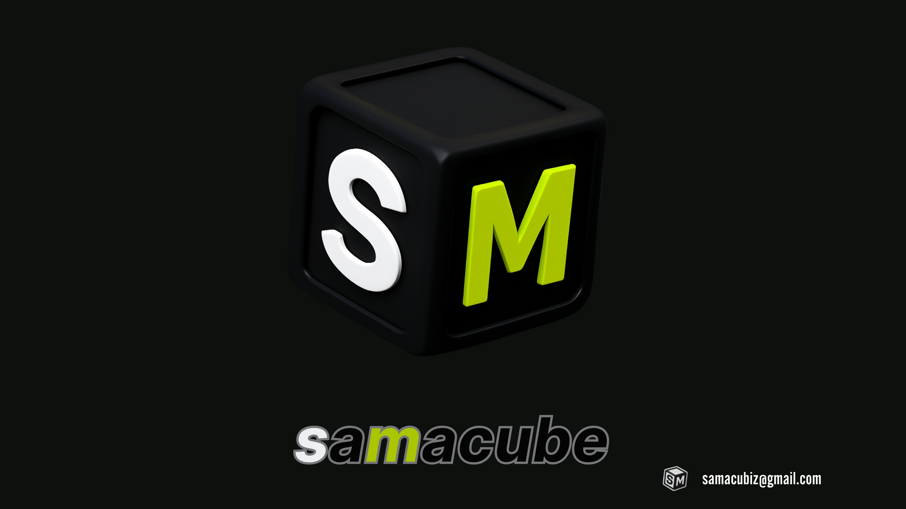

# 👋 Hey, I’m Sam

✨ Just starting out and learning how to build apps (with the help of prompts).  
🌱 Right now I’m experimenting, making mistakes, and having fun figuring things out.  

---

### 🚀 Projects
- [My First App](https://github.com/samcubiz/my-first-app)  

---

### 📚 Currently Learning
Here are some of the tools and skills I’m exploring:  

  
  
  
  

---

### 📊 GitHub Stats
  

  

  

---

### 🌐 Connect
- [My Website](https://samcubiz.github.io)  
- [GitHub](https://github.com/samcubiz)  

---

⭐ Thanks for stopping by! This profile will grow as I learn more 🚀  

